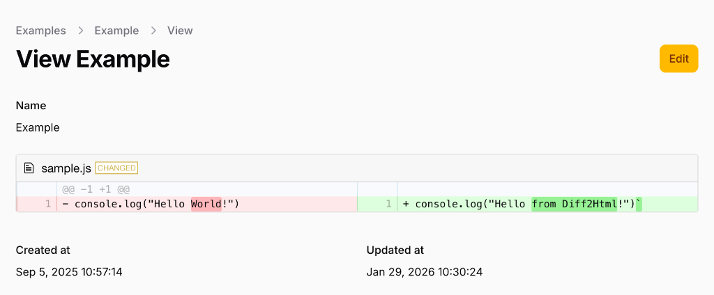

# Filament Diff View

[](https://github.com/trust-medical/diff-view/actions?query=workflow%3ATests)

A Filament plugin for viewing diffs between text or unified diff strings, powered by [diff2html](https://github.com/rtfpessoa/diff2html).



## Installation

You can install the package via composer:

```bash
composer require trust-medical/diff-view
```

## Usage

```php
DiffEntry::make('diff')
    ->old($record->old_content)
    ->new($record->new_content),
```

Or provide a pre-generated unified diff:

```php
DiffEntry::make('diff')
    ->diff($record->unified_diff),
```

### Infolists

You can use the `DiffEntry` in your Filament Infolists:

```php
use TrustMedical\DiffView\Infolists\Components\DiffEntry;

public static function configure(Schema $schema): Schema
{
    return $schema
        ->components([
            DiffEntry::make('diff')
                ->diff(<<<DIFF
                    diff --git a/sample.js b/sample.js
                    index 0000001..0ddf2ba
                    --- a/sample.js
                    +++ b/sample.js
                    @@ -1 +1 @@
                    -console.log("Hello World!")
                    +console.log("Hello from Diff2Html!")`
                    DIFF),
        ]);
}
```

### Customization

You can customize the `diff2html` display options:

```php
DiffEntry::make('diff')
    ->old($old)
    ->new($new)
    ->outputFormat('line-by-line') // 'side-by-side' (default) or 'line-by-line'
    ->matching('none')            // 'lines' (default), 'words' or 'none'
    ->drawFileList(true)          // false (default) or true
    ->hideFileTags();             // false (default) or true (hide ADDED/CHANGED/DELETED/RENAMED tags)
```

## Development

This project uses Docker for the development environment. You can run the following commands to maintain code quality:

### Run Tests
```bash
docker exec filament-app vendor/bin/phpunit
```

### Static Analysis
```bash
docker exec filament-app vendor/bin/phpstan analyze
```

### Format Code
```bash
docker exec filament-app vendor/bin/pint
```

### Build Assets
```bash
docker exec filament-app npm run build
```

## Changelog

Please see [CHANGELOG](CHANGELOG.md) for more information on what has changed recently.

## Contributing

Please see [CONTRIBUTING](CONTRIBUTING.md) for details.

## License

The MIT License (MIT). Please see [License File](LICENSE.md) for more information.
