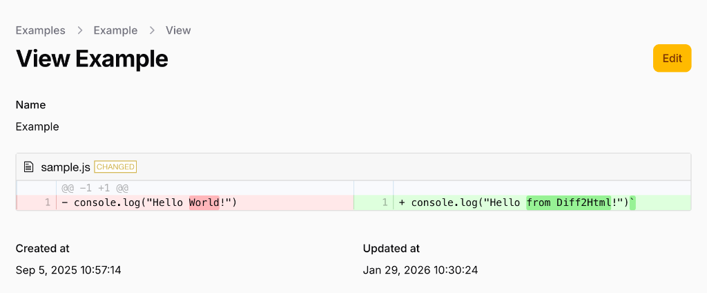

# Filament Diff View

[](https://github.com/trust-medical/filament-diff-view/actions/workflows/tests.yml)
[](LICENSE)

A [Filament](https://filamentphp.com) plugin that adds a `DiffEntry` component to Infolists for visualizing text differences.
Diffs are computed on the server with [sebastian/diff](https://github.com/sebastianbergmann/diff) and rendered in the browser with [diff2html](https://github.com/rtfpessoa/diff2html).



## Contents

- [Features](#features)
- [Requirements](#requirements)
- [Installation](#installation)
- [Quick start](#quick-start)
- [Providing the content](#providing-the-content)
- [Display options](#display-options)
- [Dark mode](#dark-mode)
- [Configuration](#configuration)
- [How assets are loaded](#how-assets-are-loaded)
- [Upgrading](#upgrading)
- [Troubleshooting](#troubleshooting)
- [Development](#development)

## Features

- Compare two strings (`old` / `new`) or render an existing unified diff.
- Side-by-side or line-by-line layout, with line or word level highlighting.
- Follows the Filament panel's dark mode automatically.
- Behaves like any other Filament entry: labels, hints, helper text, `hidden()`, `columnSpanFull()` and so on.
- Assets are lazy loaded: diff2html is downloaded only on pages that actually render a `DiffEntry`.
- Project-wide defaults through a config file, overridable per entry.

## Requirements

| Package | Version |
| --- | --- |
| PHP | 8.4+ |
| Laravel | 12.x, 13.x |
| Filament | 4.x, 5.x |
| sebastian/diff | 6.x, 7.x, 8.x (shared with PHPUnit, so any PHPUnit 11–13 project works) |

## Installation

Install the package with Composer:

```bash
composer require trust-medical/diff-view
```

Then publish the compiled assets to your `public` directory:

```bash
php artisan filament:assets
```

> [!TIP]
> Filament's recommended `post-autoload-dump` script (`@php artisan filament:upgrade`) publishes assets automatically on every `composer install` / `composer update`. If your project does not use it, run `php artisan filament:assets` after every update of this package.

The service provider is auto-discovered. Registering the `DiffView` plugin on a panel is optional and currently has no effect:

```php
use TrustMedical\DiffView\DiffView;

$panel->plugin(DiffView::make());
```

## Quick start

```php
use Filament\Schemas\Schema;
use TrustMedical\DiffView\Infolists\Components\DiffEntry;

public static function configure(Schema $schema): Schema
{
    return $schema
        ->components([
            DiffEntry::make('content_diff')
                ->label('Changes')
                ->old(fn ($record): ?string => $record->previous_content)
                ->new(fn ($record): ?string => $record->content)
                ->columnSpanFull(),
        ]);
}
```

## Providing the content

`DiffEntry` resolves what to render in this order:

1. **`diff()`**: a pre-generated unified diff string.
2. **`old()` / `new()`**: two strings. A unified diff is generated on the server.
3. **The entry state**: if none of the above are set, the value of the attribute named in `make()` is treated as a unified diff.

If nothing is available, or both `old` and `new` are empty, the entry renders only its label.

### Comparing two strings

```php
DiffEntry::make('body')
    ->old(fn ($record): ?string => $record->getOriginal('body'))
    ->new(fn ($record): ?string => $record->body);
```

All content methods accept a string, a `Stringable` (such as `Str::of(...)`), `null`, or a closure that returns one of these. Closures support Filament's usual utility injection (`$record`, `$state`, `$get`, ...). Integers and floats are cast to strings. Any other type, such as an array, throws an `InvalidArgumentException`.

### Rendering an existing unified diff

```php
DiffEntry::make('patch')
    ->diff(fn ($record): string => $record->patch);
```

diff2html takes the file names and the ADDED / CHANGED / DELETED / RENAMED status from the `---` / `+++` headers:

```diff
diff --git a/sample.js b/sample.js
--- a/sample.js
+++ b/sample.js
@@ -1 +1 @@
-console.log("Hello World!")
+console.log("Hello from Diff2Html!")
```

### Using the attribute state

If the model already stores a unified diff, the attribute name is enough:

```php
// Renders $record->patch as a unified diff.
DiffEntry::make('patch');
```

### Example: spatie/laravel-activitylog

```php
DiffEntry::make('description_diff')
    ->label('Description')
    ->old(fn (Activity $record): ?string => $record->properties['old']['description'] ?? null)
    ->new(fn (Activity $record): ?string => $record->properties['attributes']['description'] ?? null)
    ->outputFormat('line-by-line')
    ->hideFileTags();
```

## Display options

| Method | Accepted values | Default | Description |
| --- | --- | --- | --- |
| `outputFormat()` | `'side-by-side'`, `'line-by-line'` | `'side-by-side'` | Layout of the diff. |
| `matching()` | `'lines'`, `'words'`, `'none'` | `'lines'` | How diff2html pairs changed lines for highlighting. |
| `drawFileList()` | `bool` | `false` | Show the diff2html file list above the diff. |
| `hideFileTags()` | `bool` | `false` | Hide the ADDED / CHANGED / DELETED / RENAMED tags. |
| `colorScheme()` | `'filament'`, `'light'`, `'dark'`, `'auto'` | `'filament'` | See [Dark mode](#dark-mode). |

Every method also accepts a closure. Passing `null` restores the configured default. Unsupported values throw an `InvalidArgumentException` when the entry is rendered, so typos are caught early instead of being ignored.

```php
DiffEntry::make('content')
    ->old($old)
    ->new($new)
    ->outputFormat('line-by-line')
    ->matching('words')
    ->drawFileList()
    ->hideFileTags()
    ->colorScheme('light');
```

> [!NOTE]
> Diffs generated from `old()` / `new()` use the headers `--- Original` and `+++ New`. Because the two names differ, diff2html labels the result **RENAMED**. Use `hideFileTags()` to hide this tag.

Standard entry features work as usual:

```php
DiffEntry::make('content')
    ->label('Content changes')
    ->hiddenLabel()
    ->helperText('Compared with the previous revision.')
    ->visible(fn ($record): bool => filled($record->previous_content))
    ->extraAttributes(['class' => 'max-h-96 overflow-auto'])
    ->columnSpanFull();
```

## Dark mode

| Value | Behavior |
| --- | --- |
| `'filament'` | Follows the panel's theme (the `dark` class on `<html>`). The diff re-renders when the user switches themes. |
| `'light'` / `'dark'` | Always uses the given scheme. |
| `'auto'` | Follows the operating system (`prefers-color-scheme`), regardless of the panel's theme. |

## Configuration

To change the defaults for every `DiffEntry`, publish the config file:

```bash
php artisan vendor:publish --tag=diff-view-config
```

```php
// config/diff-view.php
return [
    'output_format' => 'side-by-side',
    'matching' => 'lines',
    'draw_file_list' => false,
    'hide_file_tags' => false,
    'color_scheme' => 'filament',
];
```

Values set with fluent methods always take precedence over the config file.

## How assets are loaded

The package registers two Filament assets under the `trust-medical/diff-view` package name:

| Asset | Published to |
| --- | --- |
| Alpine component `diff-entry` | `public/js/trust-medical/diff-view/components/diff-entry.js` |
| Stylesheet `diff-entry` (loaded on request) | `public/css/trust-medical/diff-view/diff-entry.css` |

Neither file is included in the panel layout. They are fetched with Filament's `x-load` / `x-load-css` directives the first time a `DiffEntry` appears on a page, so pages without a diff carry no extra weight.

diff2html escapes the diff content before rendering, so user-provided text is not interpreted as HTML.

## Upgrading

### From 2.0.x to 2.1.0

1. **Re-publish the assets.** Run `php artisan filament:assets`. The old files (`public/js/trust-medical/diff-view/diff-view-scripts.js` and `public/css/trust-medical/diff-view/diff-view-styles.css`) are no longer used and can be deleted. If your project commits `public/js` and `public/css`, commit the new files.
2. **Labels are now displayed.** `DiffEntry` now renders inside Filament's standard entry wrapper, so labels, hints and helper text appear. To keep the previous label-less look, add `->hiddenLabel()`.
3. **Dark mode is on by default.** Diffs now follow the panel's theme. To keep the previous always-light appearance, use `->colorScheme('light')` or set `color_scheme` to `'light'` in the config.
4. **Invalid option values throw.** Unsupported values for `outputFormat()`, `matching()` or `colorScheme()` now throw an `InvalidArgumentException`. Previously they were silently passed to diff2html.
5. **The entry state is used as a fallback.** When none of `diff()`, `old()` or `new()` is set, the attribute named in `make()` is now rendered as a unified diff. If that attribute holds a non-string value, such as an array cast, set the content explicitly or rename the entry.
6. **`window.Diff2Html` is gone.** diff2html is no longer exposed as a global variable. If you published and customized the `diff-entry` Blade view (`resources/views/vendor/diff-view`), re-publish it with `php artisan vendor:publish --tag=diff-view-views` and apply your changes again.

## Troubleshooting

**Nothing is rendered, or the browser console shows a 404 for `diff-entry.js`.**
The assets have not been published. Run `php artisan filament:assets`, then clear any CDN or browser cache.

**The diff shows old styling after an upgrade.**
The published assets are stale. Run `php artisan filament:assets` again.

**`InvalidArgumentException: Invalid [outputFormat] value ...`**
Check the value you passed. The allowed values are listed in the message and in [Display options](#display-options).

**The diff is shown as RENAMED.**
See the note in [Display options](#display-options), or use `diff()` with matching `---` / `+++` file names.

## Development

A Docker environment is provided. Start it with:

```bash
docker compose up -d app
```

| Task | Command |
| --- | --- |
| Install dependencies | `docker exec filament-app composer install && docker exec filament-app npm ci` |
| Run tests | `docker exec filament-app vendor/bin/phpunit` |
| Static analysis | `docker exec filament-app vendor/bin/phpstan analyze` |
| Format code | `docker exec filament-app vendor/bin/pint` |
| Build assets | `docker exec filament-app npm run build` |

The compiled assets in `dist/` are committed. After changing anything in `resources/js` or `resources/css`, rebuild and commit `dist/`. CI fails if `dist/` is out of date.

### Releasing

1. Update the `version` in `composer.json` and add an entry to [CHANGELOG.md](CHANGELOG.md).
2. Merge into `main`.
3. Create a tag such as `v2.1.0` and a GitHub release.

## Changelog

See [CHANGELOG](CHANGELOG.md) for recent changes.

## Contributing

See [CONTRIBUTING](CONTRIBUTING.md) for details.

## License

The MIT License (MIT). See the [License File](LICENSE) for more information.
